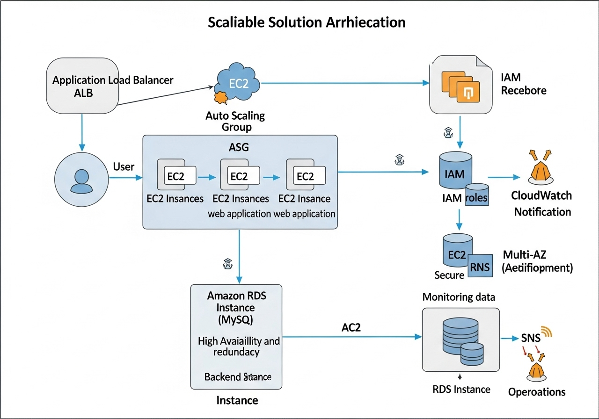

# Scalable Web Application with ALB and Auto Scaling

## Table of Content

*   [Solution Overview](#solution-overview)
*   [Architecture Diagram](#architecture-diagram)
*   [Key AWS Services Used](#key-aws-services-used)
*   [Learning Outcomes](#learning-outcomes)

## Solution Overview

This project demonstrates the deployment of a simple web application on AWS using EC2 instances, ensuring high availability and scalability with Elastic Load Balancing (ALB) and Auto Scaling Groups (ASG). It showcases best practices for compute scalability, security, and cost optimization within an EC2-based architecture.

## Architecture Diagram



## Key AWS Services Used

*   **EC2**: Launch instances for the web application.
*   **Application Load Balancer (ALB)**: Distributes incoming application traffic across multiple targets, such as EC2 instances, in multiple Availability Zones.
*   **Auto Scaling Group (ASG)**: Automatically adjusts the number of EC2 instances in response to demand, maintaining application availability and allowing for cost optimization.
*   **Amazon RDS (Optional)**: Provides a managed relational database service (MySQL/PostgreSQL) with Multi-AZ deployments for high availability and durability.
*   **IAM**: Manages access to AWS services and resources securely. Role-based access is used for instances.
*   **CloudWatch & SNS**: Amazon CloudWatch monitors AWS resources and applications, and Amazon SNS sends notifications or triggers automated actions based on predefined thresholds.

## Learning Outcomes

*   Setting up secure and scalable EC2-based web applications.
*   Implementing high availability using ALB and ASG.
*   Optimizing costs and performance using Auto Scaling policies.


### Detailed Solution Overview

This project provides a robust and scalable foundation for deploying web applications on Amazon Web Services (AWS). It leverages core AWS services to ensure high availability, fault tolerance, and cost-effectiveness. The architecture is designed to handle varying levels of traffic by dynamically adjusting compute capacity, making it suitable for a wide range of web applications, from small business websites to large-scale enterprise solutions.

The primary components of this solution include:

*   **Amazon EC2 (Elastic Compute Cloud)**: Virtual servers in the cloud that provide resizable compute capacity. EC2 instances are the backbone of the web application, hosting the application code and serving user requests.

*   **Application Load Balancer (ALB)**: A high-performance load balancer that automatically distributes incoming application traffic across multiple targets, such as EC2 instances, in multiple Availability Zones. This ensures that no single instance is overwhelmed and improves the overall fault tolerance of the application.

*   **Auto Scaling Group (ASG)**: A collection of EC2 instances that are treated as a logical grouping for the purposes of automatic scaling and management. ASGs automatically adjust the number of EC2 instances in response to demand, ensuring that the application has enough capacity to handle peak loads while optimizing costs during periods of low traffic.

*   **Amazon RDS (Relational Database Service)**: An optional, but highly recommended, managed relational database service that supports various database engines like MySQL and PostgreSQL. RDS simplifies database administration tasks such as patching, backups, and scaling. Utilizing Multi-AZ deployments with RDS ensures high availability and durability for the backend database.

*   **AWS Identity and Access Management (IAM)**: A service that helps you securely control access to AWS resources. IAM roles are used to grant necessary permissions to EC2 instances, allowing them to interact with other AWS services (e.g., S3, CloudWatch) without embedding credentials directly into the application code.

*   **Amazon CloudWatch & Amazon Simple Notification Service (SNS)**: CloudWatch is a monitoring and observability service that provides data and actionable insights to monitor your applications, respond to system-wide performance changes, and optimize resource utilization. SNS is a highly available, durable, secure, fully managed pub/sub messaging service that enables you to decouple microservices, distributed systems, and serverless applications. In this solution, CloudWatch monitors the health and performance of EC2 instances and the ALB, and can trigger SNS notifications for alerts, such as high CPU utilization or low available instances, enabling proactive management and troubleshooting.

This architecture emphasizes best practices for building resilient and scalable applications on AWS, providing a solid foundation for future growth and development.


## Implementation Details

Implementing this scalable web application architecture involves several key steps, each building upon the previous one to create a robust and highly available system. Below is a high-level overview of the implementation process:

### 1. Virtual Private Cloud (VPC) Setup

First, a Virtual Private Cloud (VPC) needs to be configured. This isolated network environment within AWS provides control over your virtual networking environment, including IP address ranges, subnets, route tables, and network gateways. For high availability, it is crucial to set up at least two public subnets and two private subnets across different Availability Zones (AZs). Public subnets will host the Application Load Balancer, while private subnets will host the EC2 instances and potentially the RDS database.

### 2. Internet Gateway and NAT Gateway

An Internet Gateway (IGW) is attached to the VPC to allow communication between instances in your VPC and the internet. For instances in private subnets to access the internet (e.g., for software updates or external API calls) without being directly accessible from the internet, a NAT Gateway (Network Address Translation) is deployed in a public subnet. Traffic from private subnets is routed through the NAT Gateway to the Internet Gateway.

### 3. Security Groups

Security Groups act as virtual firewalls for your instances to control inbound and outbound traffic. You will need to configure several security groups:

*   **ALB Security Group**: Allows inbound traffic on HTTP (port 80) and HTTPS (port 443) from anywhere (0.0.0.0/0).
*   **Web Server Security Group**: Allows inbound traffic on HTTP (port 80) only from the ALB Security Group. This ensures that only the load balancer can send traffic to your web servers.
*   **Database Security Group**: If using RDS, this security group allows inbound traffic on the database port (e.g., 3306 for MySQL, 5432 for PostgreSQL) only from the Web Server Security Group, ensuring that only your application instances can connect to the database.

### 4. EC2 Launch Template

An EC2 Launch Template defines the configuration information for launching instances. This includes the Amazon Machine Image (AMI) ID, instance type, key pair, security groups, and user data script. The user data script is particularly important as it can automate the installation of web server software (e.g., Apache, Nginx) and deploy your web application code when an instance is launched.

### 5. Application Load Balancer (ALB) Configuration

The ALB is configured to distribute incoming traffic. This involves:

*   **Listeners**: Rules that check for connection requests from clients, using the protocol and port that you configure (e.g., HTTP:80, HTTPS:443).
*   **Target Groups**: Routes requests to one or more registered targets, such as EC2 instances, using the protocol and port number that you specify. The health checks for instances are also configured here.
*   **Routing Rules**: Define how the ALB routes requests to different target groups based on various criteria (e.g., URL path, host header).

### 6. Auto Scaling Group (ASG) Configuration

The ASG is configured to automatically scale the number of EC2 instances. This involves:

*   **Launch Template Association**: The ASG uses the previously created EC2 Launch Template to launch new instances.
*   **VPC and Subnet Selection**: The ASG is configured to launch instances in the private subnets across multiple Availability Zones.
*   **Scaling Policies**: Define when the ASG should add or remove instances. Common metrics include CPU utilization, network I/O, or custom CloudWatch metrics. For example, a policy might add an instance if CPU utilization exceeds 70% for 5 minutes and remove an instance if it drops below 30% for 10 minutes.
*   **Health Checks**: The ASG uses health checks from the associated ALB to determine the health of instances. If an instance fails health checks, the ASG replaces it.

### 7. Amazon RDS (Optional) Setup

If a database is required, an Amazon RDS instance can be provisioned. Key considerations include:

*   **Database Engine**: Choose between MySQL, PostgreSQL, or other supported engines.
*   **Instance Size and Storage**: Select appropriate compute and storage based on application needs.
*   **Multi-AZ Deployment**: Enable Multi-AZ for automatic failover and high availability. This creates a synchronous standby replica in a different Availability Zone.
*   **Security Group Association**: Associate the database with the Database Security Group to control access.

### 8. IAM Roles and Policies

Create IAM roles with specific permissions for EC2 instances to interact with other AWS services. For example, an EC2 instance role might have permissions to:

*   Read from S3 buckets (if static assets are stored there).
*   Write logs to CloudWatch Logs.
*   Access secrets from AWS Secrets Manager (for database credentials).

### 9. CloudWatch and SNS for Monitoring and Alerts

Set up CloudWatch alarms to monitor key metrics for the ALB, EC2 instances, and RDS database. These alarms can trigger SNS topics, which can then send notifications (e.g., email, SMS) to administrators or trigger automated actions (e.g., Lambda functions) in response to operational events.

By following these steps, you can deploy a highly available, scalable, and cost-optimized web application on AWS, ready to handle production workloads.


## Customizing the Solution

This project is designed to be easily customizable to fit various web application requirements. The core components are modular, allowing for flexibility in deployment and configuration. Below are guidelines for customizing and deploying your own web application using this architecture.

### Prerequisites for Customization

Before you begin customizing and deploying, ensure you have the following tools and access configured:

*   **AWS Account**: An active AWS account with appropriate permissions to create and manage EC2 instances, ALB, ASG, RDS, IAM roles, CloudWatch, and SNS.
*   **AWS CLI**: The AWS Command Line Interface (CLI) installed and configured with credentials for your AWS account. This will be used for interacting with AWS services from your local machine.
*   **Git**: Installed on your local machine to clone the project repository.
*   **Basic understanding of AWS**: Familiarity with fundamental AWS concepts, including VPC, EC2, IAM, and networking.
*   **Web Application Code**: Your web application code (e.g., HTML, CSS, JavaScript, Python Flask, Node.js Express, PHP) that you intend to deploy. For a simple demonstration, a basic 'Hello World' web page will suffice.

### Deployment Steps (Manual Example)

While Infrastructure as Code (IaC) tools like AWS CloudFormation or Terraform are recommended for production deployments, a manual deployment process can help in understanding each component. Here’s a simplified manual deployment flow:

1.  **Clone the Repository**: Start by cloning this project repository to your local machine.

    ```bash
    git clone [repository-url]
    cd [project-directory]
    ```

2.  **Prepare Web Application Code**: Ensure your web application code is ready. For a simple test, you can create an `index.html` file with basic content.

    ```html
    <!DOCTYPE html>
    <html>
    <head>
        <title>My Scalable Web App</title>
    </head>
    <body>
        <h1>Hello from my Scalable Web Application!</h1>
        <p>This application is running on AWS EC2 with ALB and Auto Scaling.</p>
    </body>
    </html>
    ```

3.  **Create an EC2 AMI (Optional but Recommended)**: Instead of installing software on each instance at launch, create a custom Amazon Machine Image (AMI) that includes your web server software and application code. This speeds up instance launch times and ensures consistency.

    *   Launch a temporary EC2 instance.
    *   Install your web server (e.g., Apache, Nginx) and deploy your application code.
    *   Create an AMI from this instance.

4.  **Configure User Data for EC2 Launch Template**: If not using a custom AMI, use a user data script in your EC2 Launch Template to automate the setup process. This script runs when an EC2 instance first launches.

    ```bash
    #!/bin/bash
    sudo yum update -y
    sudo yum install -y httpd # Example for Apache on Amazon Linux
    sudo systemctl start httpd
    sudo systemctl enable httpd
    echo '<h1>Hello from your Scalable Web App!</h1>' | sudo tee /var/www/html/index.html
    ```

5.  **Create EC2 Launch Template**: Define the configuration for your EC2 instances, including the AMI ID (custom or public), instance type, key pair, security groups, and the user data script.

6.  **Configure Target Group**: Create an ALB Target Group that specifies the protocol and port for health checks (e.g., HTTP:80) and the health check path (e.g., `/index.html`).

7.  **Create Application Load Balancer (ALB)**: Provision an ALB in your public subnets. Configure listeners for HTTP (port 80) and optionally HTTPS (port 443, requiring an SSL certificate). Associate the listener with your Target Group.

8.  **Create Auto Scaling Group (ASG)**: Create an ASG, linking it to your EC2 Launch Template and specifying the private subnets where instances should be launched. Define desired capacity, minimum capacity, and maximum capacity. Configure scaling policies based on metrics like CPU utilization.

9.  **Test the Application**: Once the ASG launches instances and they register with the ALB, access your web application using the ALB's DNS name. Verify that traffic is distributed and that scaling policies work as expected.

### Infrastructure as Code (IaC) Deployment (Recommended)

For production environments, it is highly recommended to use IaC tools such as AWS CloudFormation, Terraform, or AWS CDK. These tools allow you to define your infrastructure in code, enabling version control, automation, and consistent deployments. A typical IaC deployment would involve:

*   **Defining Resources**: Writing templates or scripts that declare all AWS resources (VPC, subnets, security groups, ALB, ASG, EC2 Launch Template, RDS, IAM roles, CloudWatch alarms, SNS topics).
*   **Parameterization**: Using parameters to make your templates reusable across different environments (e.g., development, staging, production).
*   **Deployment**: Using the IaC tool's CLI or console to deploy the stack. The tool handles the provisioning and configuration of all resources.
*   **Updates and Rollbacks**: IaC tools facilitate easy updates to your infrastructure and provide mechanisms for rolling back to previous versions if issues arise.

This project provides the architectural blueprint, and you can translate this into your preferred IaC framework for automated and repeatable deployments.

